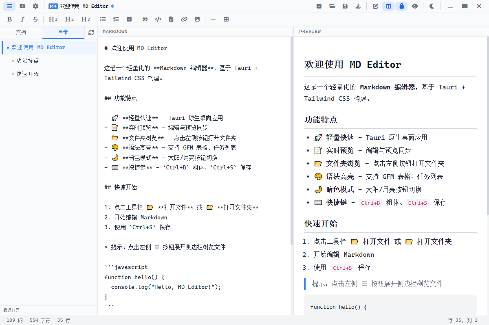
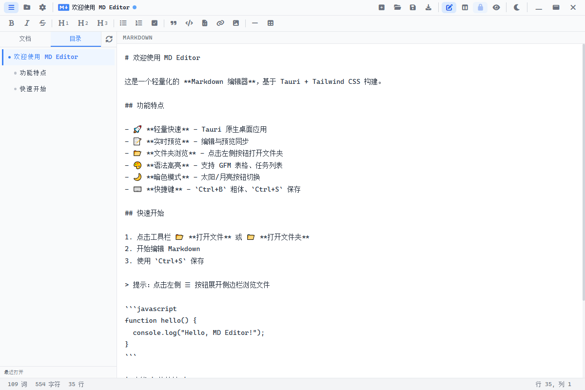
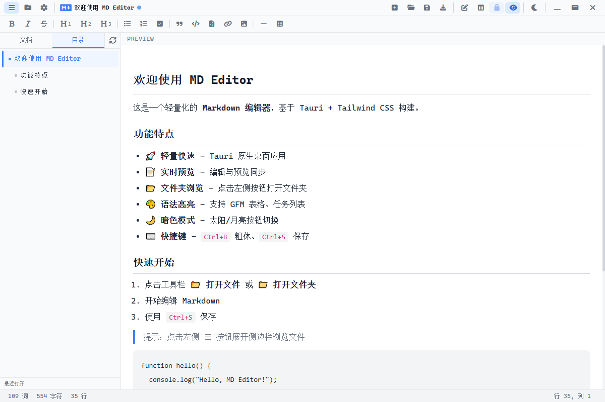
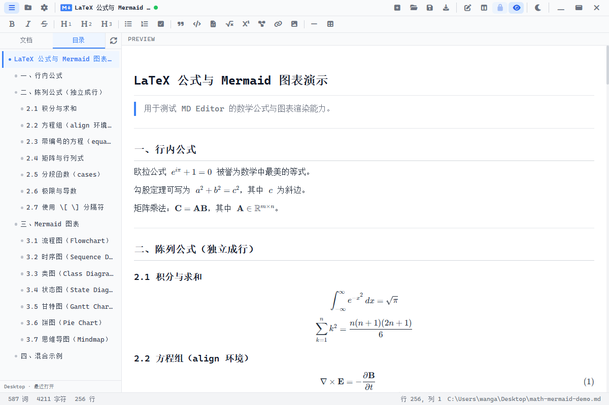
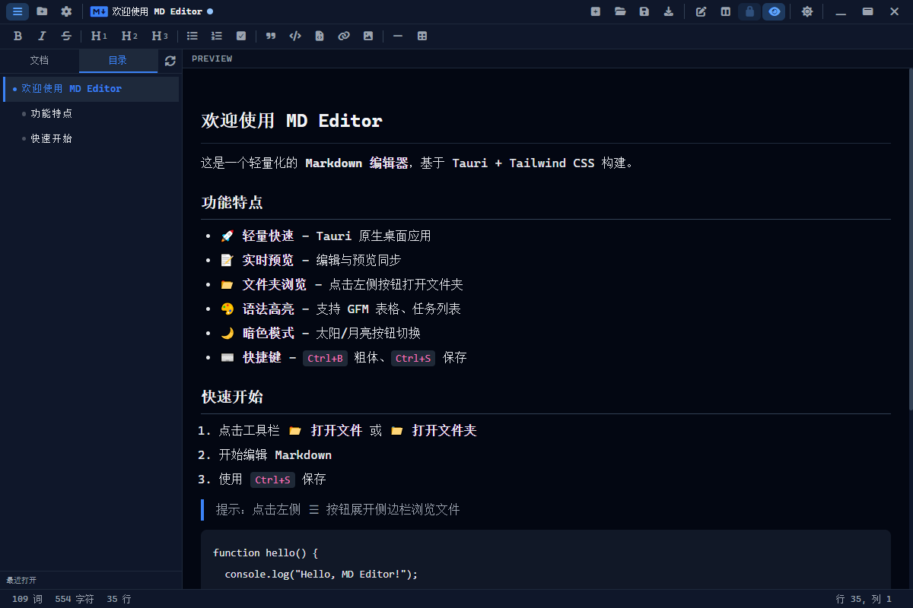
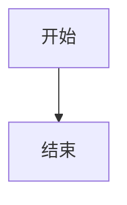

# MD Editor

一款轻量、快速的 **Markdown 桌面编辑器**，基于 [Tauri 2](https://v2.tauri.app/) 构建。采用无边框原生窗口，支持实时预览、LaTeX 数学公式、Mermaid 图表、文件夹浏览、暗色模式与丰富的 Markdown 编辑工具，适合日常写作、笔记整理与文档编写。

**当前版本：** 0.1.1

---

## 界面预览

### 分屏模式（亮色主题）

左侧 Markdown 编辑、右侧实时预览，适合边写边看效果。



### 仅编辑模式

隐藏预览区与侧边栏，编辑区占满窗口，适合专注写作。



### 仅预览模式 + 文件浏览器

打开文件夹后，侧边栏列出目录内 Markdown 文件，点击即可切换。



### LaTeX 公式与 Mermaid 图表

支持行内/陈列公式、`\begin{}` 环境及多种 Mermaid 图表，预览实时渲染。



完整示例见仓库内的 [math-mermaid-demo.md](math-mermaid-demo.md)（可用 MD Editor 直接打开预览）。

### 暗色主题

一键切换暗色模式，夜间使用更舒适。



### 设置面板

可配置默认视图、主题、侧边栏、文档列表与 Windows 文件关联等。


---

## 功能特性

### 编辑与预览

- **实时预览** — 输入时自动渲染 Markdown，支持 GFM（GitHub Flavored Markdown）
- **三种视图模式**
  - 仅编辑：专注写作，编辑区占满窗口
  - 分屏：左侧编辑、右侧预览，中间可拖动调节比例
  - 仅预览：全屏查看渲染结果
- **工具栏快捷插入** — 粗体、斜体、删除线、标题、列表、任务列表、引用、代码、**行内公式 / 陈列公式**、**Mermaid 图表**、链接、图片、表格等
- **等宽字体编辑区** — 使用 JetBrains Mono / Fira Code 等等宽字体，便于对齐代码与表格

### 数学公式（KaTeX）

- **行内公式**：`$E=mc^2$`、`\(...\)`
- **陈列公式（独立成行）**：`$$...$$`、`\[...\]`
- **LaTeX 环境**：`\begin{equation}`、`\begin{align}`、`\begin{pmatrix}`、`\begin{cases}` 等（KaTeX 支持范围内）
- 工具栏提供行内公式、陈列公式快捷插入

### 图表（Mermaid）

- 使用标准围栏代码块 ` ```mermaid ` 编写流程图、时序图、类图、甘特图、饼图、思维导图等
- 预览区异步渲染，随主题自动切换浅色/深色样式
- 工具栏提供 Mermaid 模板快捷插入

> 语法与示例汇总：[math-mermaid-demo.md](math-mermaid-demo.md)

### 文件管理

- **新建 / 打开 / 保存 / 另存为** — 支持 `.md`、`.markdown`、`.txt` 格式
- **侧边栏文件浏览器** — 打开文件夹后列出目录内所有 Markdown 文件，点击即可切换
- **未保存提示** — 切换或关闭未保存文件时会提示确认
- **状态栏信息** — 实时显示词数、字符数、行数、光标位置及当前文件路径

### 界面与体验

- **无边框窗口** — 自定义标题栏，集成最小化 / 最大化 / 关闭按钮
- **亮色 / 暗色主题** — 一键切换，适配不同使用环境
- **可折叠侧边栏** — 需要更大编辑区域时可隐藏文件浏览器
- **Toast 提示** — 保存成功等操作有轻量反馈

### 性能

- 基于 Tauri 原生架构，安装包体积小、内存占用低
- 预览更新带防抖（100ms），大文档编辑依然流畅

---

## 技术栈

| 层级 | 技术 |
|------|------|
| 桌面框架 | [Tauri 2](https://v2.tauri.app/) |
| 后端 | Rust |
| 前端 | TypeScript + Vite |
| 样式 | Tailwind CSS 4 |
| Markdown 渲染 | [marked](https://marked.js.org/) |
| 数学公式 | [KaTeX](https://katex.org/) |
| 图表 | [Mermaid](https://mermaid.js.org/) |
| 图标 | Font Awesome |
| 文件对话框 | `@tauri-apps/plugin-dialog` |

---

## 项目结构

```
md-editor/
├── index.html              # 应用主页面
├── math-mermaid-demo.md    # LaTeX 公式与 Mermaid 图表示例文档
├── screenshot/             # 应用截图（README 展示用）
├── public/
│   └── startup-bootstrap.js # 启动时同步应用缓存配置
├── src/
│   ├── main.ts             # 前端逻辑（编辑、预览、文件、快捷键等）
│   ├── markedMath.ts       # LaTeX 公式解析与渲染
│   ├── bootstrapSettings.ts # 启动配置缓存与应用
│   ├── styles.css          # 全局样式与主题变量
│   └── assets/             # 静态资源（如图标 SVG）
├── src-tauri/
│   ├── src/
│   │   ├── main.rs     # Rust 入口
│   │   └── lib.rs      # Tauri 命令（读写文件、列出 Markdown）
│   ├── icons/          # 应用图标（打包时使用）
│   ├── tauri.conf.json # Tauri 配置
│   └── Cargo.toml      # Rust 依赖
├── package.json
└── vite.config.ts
```

---

## 环境要求

开始开发或打包前，请确保已安装：

- [Node.js](https://nodejs.org/)（建议 18+）
- [Rust](https://www.rust-lang.org/tools/install)（含 Cargo）
- Windows 打包还需 [Visual Studio Build Tools](https://visualstudio.microsoft.com/visual-cpp-build-tools/)（含 C++ 工作负载）

详细环境配置可参考 [Tauri 官方前置要求](https://v2.tauri.app/start/prerequisites/)。

---

## 快速开始

### 安装依赖

```bash
npm install
```

### 开发模式

启动前端开发服务器与 Tauri 桌面窗口：

```bash
npm run tauri dev
```

### 构建前端（仅 Web）

```bash
npm run build
```

### 打包桌面应用

```bash
npm run tauri build
```

打包完成后，产物位于：

| 平台 | 路径 |
|------|------|
| Windows 可执行文件 | `src-tauri/target/release/md-editor.exe` |
| Windows 安装包 (NSIS) | `src-tauri/target/release/bundle/nsis/` |
| Windows 安装包 (MSI) | `src-tauri/target/release/bundle/msi/` |

> **图标说明：** Windows 可执行文件的图标来自 `src-tauri/icons/icon.ico`，在 Rust 编译时嵌入。更换图标请使用 `npm run tauri icon <源图路径>` 重新生成全套图标后再打包。

---

## 使用说明

### 基本操作

1. 启动应用后，在编辑区直接输入 Markdown
2. 点击工具栏 **打开** 选择本地文件，或 **打开文件夹** 在侧边栏浏览
3. 使用 **Ctrl+S** 保存当前文件
4. 通过工具栏右侧三个按钮切换「仅编辑 / 分屏 / 仅预览」
5. 需要公式或图表时，使用工具栏对应按钮插入，或打开 [math-mermaid-demo.md](math-mermaid-demo.md) 参考写法

### 侧边栏

- 点击 **☰** 按钮展开或收起侧边栏
- 点击 **📁+** 打开文件夹，侧边栏会列出该目录下所有 Markdown 文件
- 点击文件名即可打开，当前文件会高亮显示

### 分屏调节

在分屏模式下，拖动编辑区与预览区之间的竖线，可调整左右面板宽度（范围 20% ~ 80%）。

---

## 快捷键

| 快捷键 | 功能 |
|--------|------|
| `Ctrl+N` | 新建文件 |
| `Ctrl+O` | 打开文件 |
| `Ctrl+S` | 保存 |
| `Ctrl+Shift+S` | 另存为 |
| `Ctrl+B` | 粗体 |
| `Ctrl+I` | 斜体 |

> macOS 上 `Ctrl` 对应 `Cmd`。

---

## 支持的 Markdown 语法

通过 [marked](https://marked.js.org/) 渲染，主要支持：

- 标题（H1 ~ H4）
- 粗体、斜体、删除线
- 有序 / 无序列表
- 任务列表（`- [ ]` / `- [x]`）
- 引用块
- 行内代码与围栏代码块
- 链接与图片
- 表格（GFM）
- 分割线

### 数学公式（KaTeX）

| 类型 | 写法示例 |
|------|----------|
| 行内 | `$E=mc^2$`、`\(\frac{a}{b}\)` |
| 陈列 | `$$\int_0^1 x^2\,dx$$`、`\[ E = mc^2 \]` |
| 环境 | `\begin{equation}...\end{equation}`、`\begin{align}...\end{align}`、矩阵/分段函数等 |

矩阵换行请使用 `\\`（两个反斜杠），列之间用 `&` 分隔。

### Mermaid 图表

````markdown

````

支持 flowchart、sequenceDiagram、classDiagram、gantt、pie、mindmap 等常见类型。

**完整示例文档：** [math-mermaid-demo.md](math-mermaid-demo.md)

---

## 自定义应用图标

1. 准备一张 **1024×1024** 的正方形 PNG 或 SVG（建议带透明背景）
2. 生成全套平台图标：

```bash
npm run tauri icon path/to/your-icon.png
```

3. 清理并重新打包：

```bash
cd src-tauri && cargo clean && cd ..
npm run tauri build
```

生成的图标会写入 `src-tauri/icons/` 目录。Windows 可执行文件图标以 `icon.ico` 为准。

---

## 推荐开发工具

- [VS Code](https://code.visualstudio.com/)
- [Tauri VS Code 扩展](https://marketplace.visualstudio.com/items?itemName=tauri-apps.tauri-vscode)
- [rust-analyzer](https://marketplace.visualstudio.com/items?itemName=rust-lang.rust-analyzer)

---

## 作者

**anfu**

---

## 赞赏支持

如果这个项目对你有帮助，欢迎扫码支持 ☕

| 微信支付 | 支付宝 |
|--------|--------|
|  |  |

---

## 许可证

本项目为私有项目（`package.json` 中 `"private": true`）。如需开源或添加许可证，请自行补充 LICENSE 文件。
