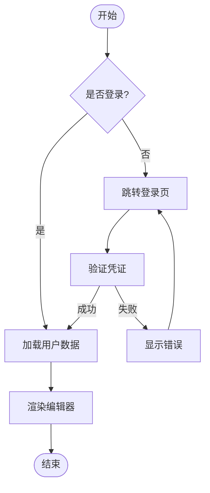
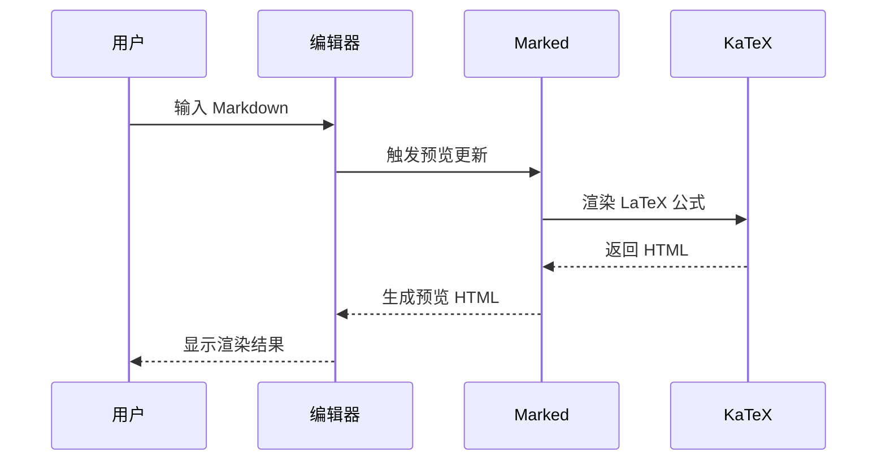
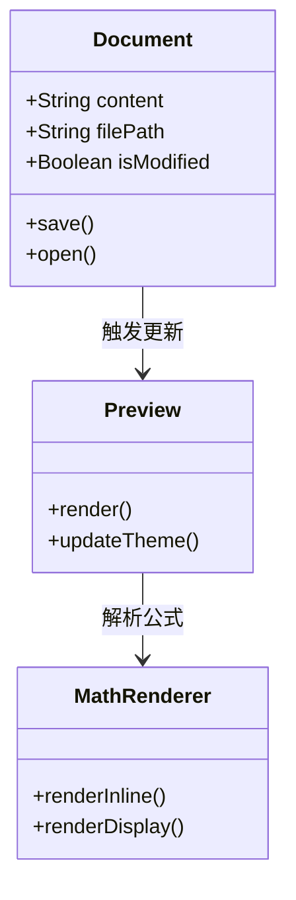
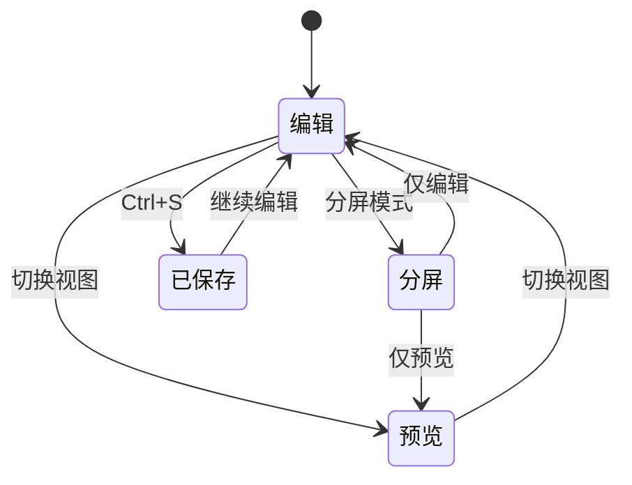
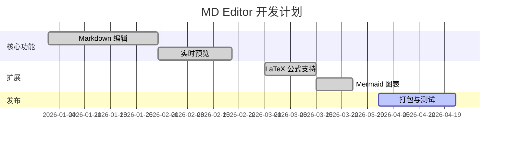
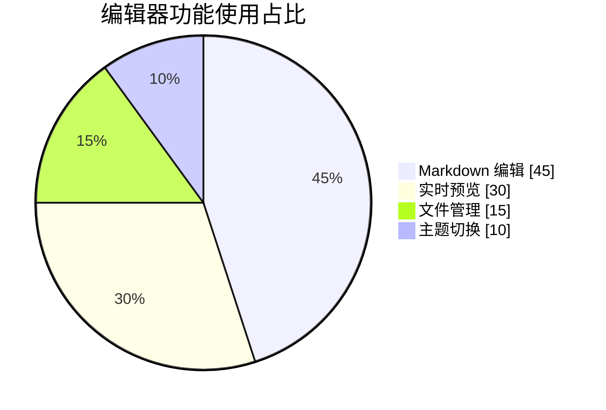
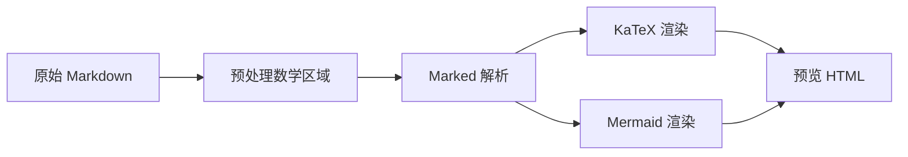

# LaTeX 公式与 Mermaid 图表演示

> 用于测试 MD Editor 的数学公式与图表渲染能力。

---

## 一、行内公式

欧拉公式 $e^{i\pi} + 1 = 0$ 被誉为数学中最美的等式。

勾股定理可写为 \(a^2 + b^2 = c^2\)，其中 \(c\) 为斜边。

矩阵乘法：$\mathbf{C} = \mathbf{A}\mathbf{B}$，其中 $\mathbf{A} \in \mathbb{R}^{m \times n}$。

---

## 二、陈列公式（独立成行）

### 2.1 积分与求和

$$
\int_{-\infty}^{\infty} e^{-x^2}\, dx = \sqrt{\pi}
$$

$$
\sum_{k=1}^{n} k^2 = \frac{n(n+1)(2n+1)}{6}
$$

### 2.2 方程组（align 环境）

\begin{align}
\nabla \times \mathbf{E} &= -\frac{\partial \mathbf{B}}{\partial t} \\
\nabla \times \mathbf{B} &= \mu_0 \mathbf{J} + \mu_0 \varepsilon_0 \frac{\partial \mathbf{E}}{\partial t} \\
\nabla \cdot \mathbf{E} &= \frac{\rho}{\varepsilon_0} \\
\nabla \cdot \mathbf{B} &= 0
\end{align}

### 2.3 带编号的方程（equation + split）

\begin{equation}
\begin{split}
\mathcal{L} &= \frac{1}{2}(\partial_\mu \phi)(\partial^\mu \phi) - \frac{1}{2}m^2 \phi^2 - \frac{\lambda}{4!}\phi^4 \\
&= \int d^4x \left[ \frac{1}{2}(\partial_\mu \phi)^2 - V(\phi) \right]
\end{split}
\end{equation}

### 2.4 矩阵与行列式

> 矩阵换行请使用 `\\`（两个反斜杠），列之间用 `&` 分隔。

$$
\det(\mathbf{A}) = \sum_{\sigma \in S_n} \mathrm{sgn}(\sigma) \prod_{i=1}^{n} a_{i,\sigma(i)}
$$

$$
\begin{pmatrix}
\cos\theta & -\sin\theta & 0 \\
\sin\theta & \cos\theta & 0 \\
0 & 0 & 1
\end{pmatrix}
\begin{pmatrix} x \\ y \\ 1 \end{pmatrix}
=
\begin{pmatrix}
x\cos\theta - y\sin\theta \\
x\sin\theta + y\cos\theta \\
1
\end{pmatrix}
$$

$$
\begin{vmatrix}
a & b \\
c & d
\end{vmatrix} = ad - bc
$$

### 2.5 分段函数（cases）

$$
f(x) = \begin{cases}
x^2 & \text{if } x \geq 0 \\
-x & \text{if } x < 0
\end{cases}
$$

### 2.6 极限与导数

$$
\lim_{n \to \infty} \left(1 + \frac{1}{n}\right)^n = e
$$

$$
\frac{\partial^2 u}{\partial t^2} = c^2 \nabla^2 u
$$

### 2.7 使用 \[ \] 分隔符

\[
\hat{H}\lvert \psi \rangle = E \lvert \psi \rangle, \quad
\langle \psi \vert \psi \rangle = 1
\]

---

## 三、Mermaid 图表

### 3.1 流程图（Flowchart）

### 3.2 时序图（Sequence Diagram）

### 3.3 类图（Class Diagram）

### 3.4 状态图（State Diagram）

### 3.5 甘特图（Gantt Chart）

### 3.6 饼图（Pie Chart）

### 3.7 思维导图（Mindmap）

---

## 四、混合示例

下面同时包含公式与文字说明：

薛定谔方程

\begin{equation}
i\hbar \frac{\partial}{\partial t}\Psi(\mathbf{r}, t)
= \left[ -\frac{\hbar^2}{2m}\nabla^2 + V(\mathbf{r}, t) \right] \Psi(\mathbf{r}, t)
\end{equation}

数据处理流程如下：

贝叶斯定理：

$$
P(A \mid B) = \frac{P(B \mid A)\, P(A)}{P(B)}
$$

---

*文档生成于 MD Editor 测试 — 可在编辑器中打开此文件验证渲染效果。*
